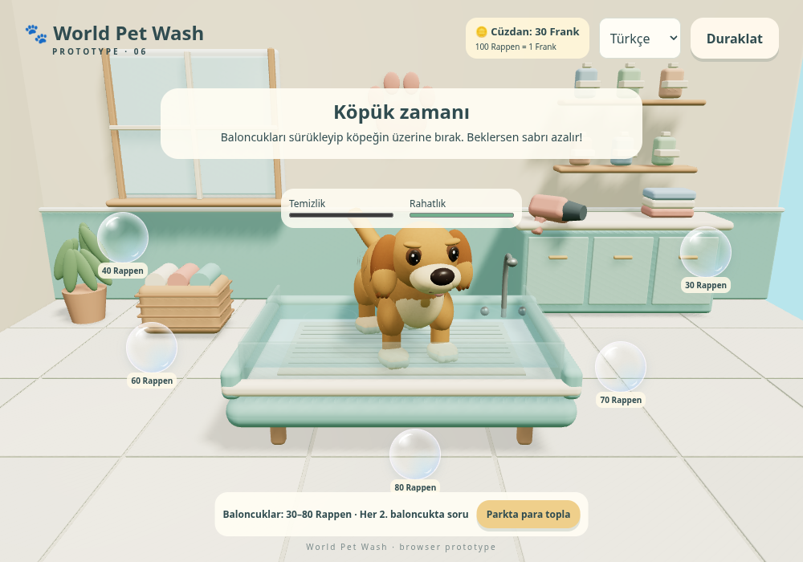
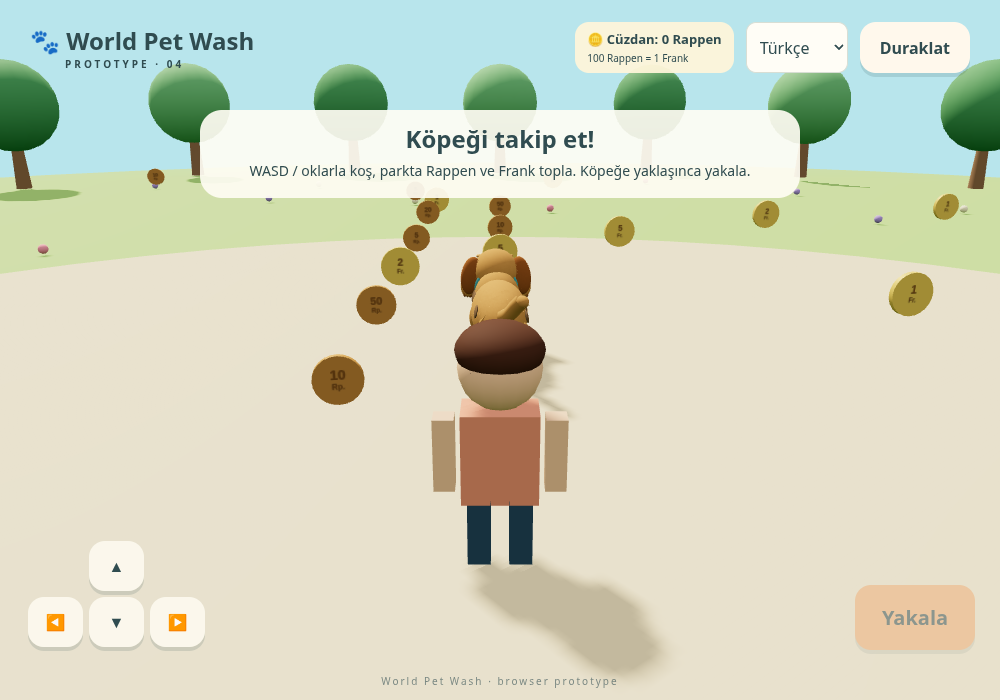
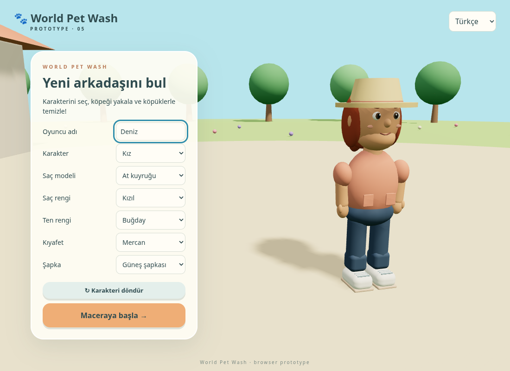

# World Pet Wash

Türkçe, İngilizce ve Almanca destekli 3B tarayıcı oyunu prototipi. Node.js 22.12+ gerekir.



```sh
npm ci
npm run dev
npm run build
npm test
```

Karakter seçimi → parkta köpeği yakalama → zamanlama oyunu → baloncukları sürükleyerek yıkama → kontrollü fön → kıyafet seçimi → yıldız değerlendirmesi.

WASD / ok tuşları: ileri, geri ve dönüş. Boşluk: yakalama/zamanlama. Telefonda ekran düğmeleri kullanılır; yatay ekran önerilir. Yıkamada baloncukları köpeğin üzerine bırakın. Fön ekranında dört ıslak bölgenin düğmelerinde basılı tutun; sıcaklık göstergesi kırmızıya dönmeden başka bölgeye geçin. Bırakınca bölge soğur. Fare, dokunmatik veya odaklanmış düğmede boşluk/Enter kullanılabilir. Kıyafet ekranında köpeğin sevdiği rengi takip ederek toka, gözlük, şapka ve kıyafet seçin. Dört beğenilen seçimden sonra bakımı tamamlayın. Beğenmediği her seçim rahatlığı azaltır. Kaçışta köpeği yeniden yakalayıp yalnızca yarım kalan aşamayı baştan tamamlayın; biten yıkama ve fön korunur. En iyi yıldız sonucu tarayıcıda saklanır. Hesap veya sunucu gerekmez.

Tüy kesimi, hesap soruları ve sahiplenme sonrası kişiselleştirme sonraki sürümlerdedir. Köpek ve bakım odası özgün, yumuşak hatlı 3B modellerden oluşur (`src/visuals.js`). Köpekte yerel olarak üretilen tüy dokusu, doğal patiler, göz kırpma, kuyruk ve koşma animasyonları; odada küvet, dolaplar, havlular, şişeler ve hareketli fön vardır. Harici model veya görsel servisi gerekmez. Odanın sabit detayları malzemeye göre birleştirilir; tüy demetleri tek instanced çizimde gösterilir. Üretim sürümü için mobil cihazlarda performans ve erişilebilirlik ayrıca doğrulanmalıdır.

## Rappen ve Frank



Büyütülmüş parkta 5, 10, 20 ve 50 Rappen; 1, 2 ve 5 Frank değerinde oyun paraları toplanır. 100 Rappen = 1 Frank. Cüzdan her yeni oyunda sıfırlanır; fiyatlar yeni oyun başında değişir ve o oyun boyunca sabit kalır. Baloncuk başına ödeme yapılır. Fön her denemede bir kez açılır; düğmeye basılı tutmak tekrar ücretlendirilmez. Her yeni kıyafet denemesi ücretlidir; zaten giyilen seçeneğe yeniden basmak ücretsizdir.

Para yetmezse işlemler gerçekleşmez ve cüzdan eksiye düşmez. “Parkta para topla” ile yarım kalan bakımın ilerlemesi korunarak para toplanabilir; “Bakıma dön” tekrar yakalamadan kaldığınız yerden devam eder. Gerçek kaçışta yalnızca yarım kalan aşama sıfırlanır; ödenen ücretler iade edilmez. Bütün paralar toplanırsa yeni bir parti oluşur. Parası olmayan oyuncunun yıkama bekleme süresi durur.

Bu sürümde hesap sorusu ve gerçek para/ödeme yoktur; toplama, fiyatları görme ve oyun cüzdanından harcama altyapısı vardır.

## Karakter oluşturma

Kız ve erkek farklı başlangıç saçları ve kıyafet detaylarıyla gelir. Dört saç modeli (kısa, omuz hizası, at kuyruğu, kıvırcık), beş saç rengi, dört ten rengi, dört kıyafet rengi ve spor şapka/güneş şapkası/bere seçenekleri her iki karakter için de kullanılabilir. “Karakteri döndür” ile görünümü inceleyebilirsiniz. Seçimler ve isim dil değiştirirken korunur; koşarken kol ve bacaklar hareket eder. Modeller `src/character.js` içinde özgün olarak üretilir.



Yıkamada her ikinci başarılı baloncuk için kalan para sorusu sorulur; diğer baloncuklar doğrudan satın alınır. Ekrandaki baloncuklar farklı fiyatlara sahiptir (30–80 Rappen); her birinin fiyatı üzerinde görünür. Fön başlatma ve kıyafet denemelerinde her alışverişte soru sorulur. Fiyatlar soruda da Frank/Rappen biçiminde görünür; cevaplar yan yana Frank ve Rappen kutularına yazılır. Rappen kısmı 0–99 olmalıdır; olmayan birime 0 yazılır. Yanlış cevap veya vazgeçme para kesmez. Soru açıkken oyun ve rahatlık sayacı durur. Doğru cevapta işlem hemen tamamlanır; ikinci bir satın alma veya parka geçiş onayı gerekmez.

Para toplamak için parka gitmeden önce rastgele Frank/Rappen toplama sorusu çözülür; örneğin 4 Frank 10 Rappen + 10 Frank 90 Rappen = 15 Frank 0 Rappen. Soru ödül para vermez, parka erişim sağlar. Dönüşte yarım kalan bakım korunur.

Fön ısısı kırmızı alana (>65) girer girmez köpek patisiyle fönü iter ve fön havada dönerek uzaklaşır. Fön aşaması sıfırlanır, tamamlanan yıkama korunur. Yeni soruyu çözüp fönü yeniden satın almak gerekir; önceki ödeme iade edilmez. Bu özellikler Türkçe, İngilizce ve Almanca desteklidir.

Soru ekranında cüzdan üstte, ürün fiyatı altta vurgulanır. Yanlış cevap kırmızı mesaj ve kısa titreme gösterir; doğru cevap yeşil mesaj ve yıldız efektiyle 550 ms sonra işlemi otomatik tamamlar. Hareket azaltma tercihi CSS efektlerini kapatır.

Park çapı 108 birimdir. Köpeğe yaklaşınca Yakala/Space zıplamayı başlatır. Çocuk havada dururken köpeğin üzerindeki hedef halkası yeşil olduğunda fareyle tıklayın veya telefonda dokunun (Space de desteklenir). Erken/geç tıklama, hedef dışına basma veya bekleme köpeğin kaçmasına neden olur. Başarılı yakalamada karakter köpeği kucağına alır ve bakım odasına geçer. Duraklatma yakalama süresini de durdurur.

Karakterin güncel sürümü daha doğal baş/gövde oranları, parmaklar, bükülen dirsek ve dizler, göz kapağı hareketi, kumaş/saç/yüz için yerel üretilmiş hafif bump dokuları kullanır. Koşma ve kucaklama pozları eklem gruplarıyla hareket eder. Bu hâlâ prosedürel Three.js modelidir; Blender/GLB varlığı eklenmemiştir. Saç, şapka, ten ve kıyafet seçenekleri korunmuştur.

Washing now takes place in a small shallow water tank with translucent sides and gentle ripples. Floating soap bubbles have reflective highlights and slowly drift in bounded paths; grabbing one holds it under the pointer, and questions/pause freeze movement. Bubble prices and every-second-bubble questions are unchanged. The washing patience countdown runs more slowly for a relaxed pace. Reduced-motion preferences stop bubble drift; focused bubbles can also be applied with Enter/Space. Dirt uses local mottled mud textures with soft transparent edges, and disappears as washing progresses. Water is hidden for drying and dressing.
